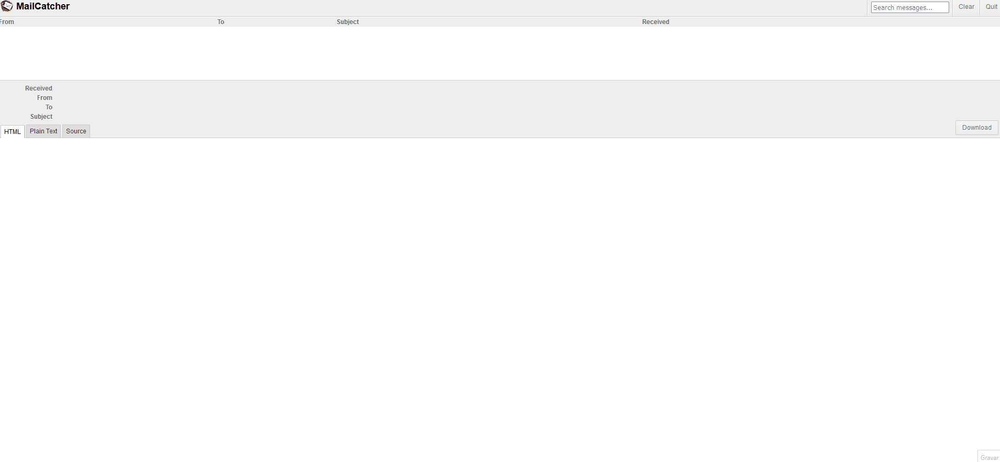
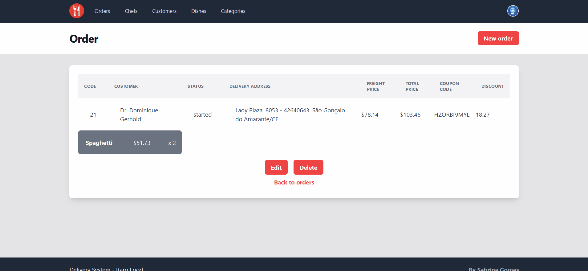
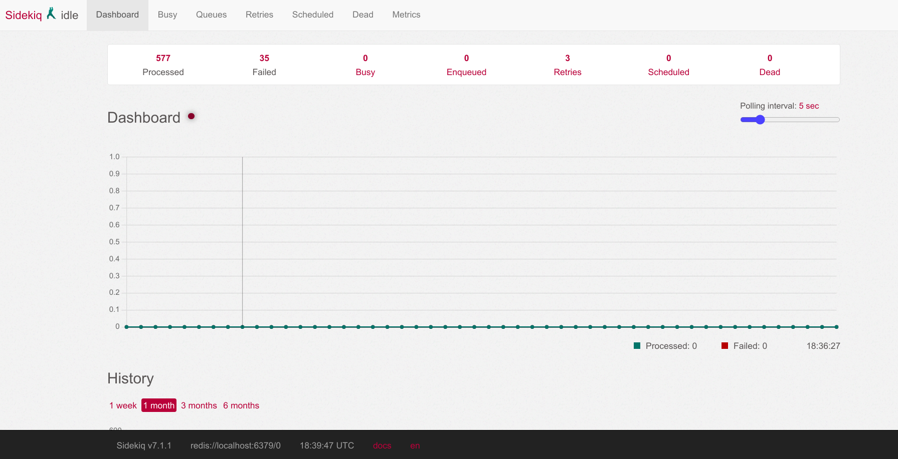
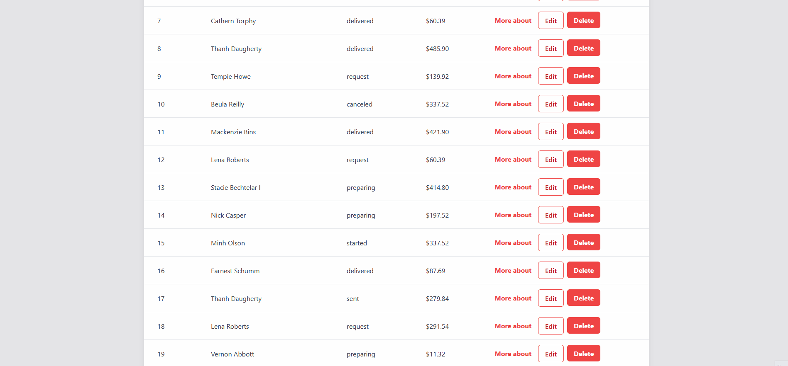
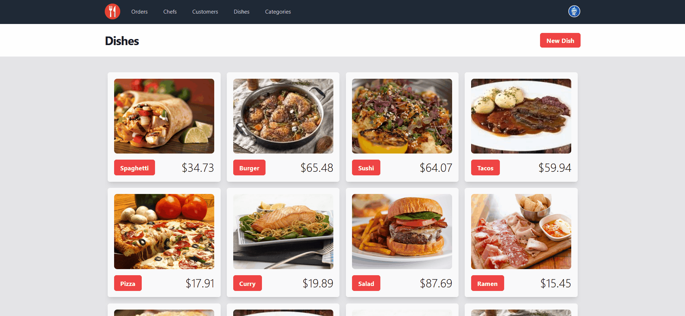

# Mailer / Job / Hotwire / Active Storage - Raro Food

Nesse projeto foram feitas algumas implementações, porém toda sua base de modelagem, controller e views foram clonados do exercício da semana 11. Na sequência as novas funcionalidades referentes a Mailer, Job, Hotwire e Active Storage serão detalhadas.

## Objetivos

Tendo como base o [enunciado do exercício](./.gitlab/enunciado.md), os objetos são:

- [x] Implementar envio de e-mail assíncrono para o chefe notificando que um novo prato foi adicionado a um determinado pedido. No e-mail deve conter:
  - [x] Código do pedido;
  - [x] Nome e e-mail do cliente;
  - [x] Nome, descrição e preço unitário do prato;
- [x] Implementar Job enfileirado em uma _queue_ chamada "dishes". O Job deverá:
  - [x] Atualizar o **preço unitário** dos itens nos pedidos que possuem o prato que foi atualizado;
  - [x] Atualizar o **preço total** dos pedidos que possuem o prato que foi atualizado;
  - [x] Aplicar as atualizações mencionadas apenas nos pedidos com status _started_.
- [x] Atualizar a tela de edição de pedidos para que a adição de _itens do pedido_ seja realizada de forma dinâmica, utilizando Stimulus Components;
- [x] Implementar o upload de fotos e o console de ferramentas para estilização de texto (WYSIWYG) para entidade Dish.

## Desenvolvimento

Para iniciar a atividade foi realizado um clone do repositório da atividade entregue para a semana 11, que pode ser verificado [aqui](https://git.raroacademy.com.br/sabrina.gomes/sabrina-gomes-exercicio-semana-11). Em seguida estão os detalhes de cada uma das implementações.

### Mailer

Para implementação do mailer foi utilizado o MailCatcher, que simula um servidor de e-mail e os exibe em uma interface web. Para instalar o MailCatcher foi utilizado o comando `gem install mailcatcher` e para iniciar o servidor foi utilizado o comando `mailcatcher`. A interface web pode ser acessada através do endereço `http://localhost:1080/`.

O próximo passo foi criar o arquivo `order_item_mailler` na pasta `app/mailers` e definir o método `order_item_added` que recebe como parâmetro o objeto `order_item`. Nesse método foi definido o e-mail do destinatário e o assunto, além de incluir as variáveis que precisam estar disponíveis para serem chamadas no template do e-mail. O arquivo `order_item_added.html.erb` contém o HTML do e-mail que será enviado, nele foram utilizadas as variáveis `@order` e `@order_item` e realizada a estilização com CSS.

Por fim, no model `order_item.rb` foi adicionado o callback `after_commit` que chama o método `order_item_added` do mailer. Dessa forma, toda vez que um novo item for adicionado a um pedido o e-mail será enviado. No MailCatcher é possível visualizar os e-mails enviados, demonstrado abaixo.

  <div align="center">
    
  </div>

### Job

O primeiro passo para iniciar a implementação do Job solicitado foi realizar as configurações necessárias, seguindo os passos vistos em aula. Depois de instalar o Redis e o Sidekiq, foi criado o arquivo `sidekiq.rb` na pasta `initializers` com as informações necessárias. Já dentro de `config`foi criado o arquivo `sidekiq.yml` onde foi definida a queue `dishes`.

O passo seguinte foi criar o arquivo `update_price_job.rb` e definir o método `perform`. Nesse método foi definido o código que deve ser executado quando o Job for chamado, que é atualizar o preço unitário dos itens nos pedidos que possuem o prato que foi atualizado e atualizar o preço total dos pedidos em questão. Para isso, foi utilizado o método `enqueue_price_update_job` criado no model `dish.rb`. Nesse mesmo model foi adicionado o callback `after_commit` que chama (apenas na ação de update) o método `perform` do Job. Dessa forma, toda vez que um prato for atualizado, o Job será chamado e realizará as atualizações necessárias.
Para finalizar, foi realizada a remoção do callback `can_unit_price_be_changed?` para facilitar no teste do Job, já que ele não permitia que o preço unitário fosse alterado se o item em questão estivesse, além de um pedido com status _started_, em um pedido que já foi finalizado.

  <div align="center">
    
  </div>

O painel de administração do Sidekiq pode ser acessado através do endereço `http://localhost:3000/sidekiq`, conforme imagem abaixo. Nas instruções de SETUP terá mais detalhes sobre como acessar o painel.

  <div align="center">
    
  </div>

### Hotwire

O [stimulus nested form](https://www.stimulus-components.com/docs/stimulus-rails-nested-form/) foi usado para que o formulário de Dish pudesse receber os novos itens de forma dinâmica, sem a necessidade de recarregar a página. Antes de iniciar os ajustes nos formulários foi necessário instalar o recurso citado através do comando `yarn add stimulus-rails-nested-for`.

Para tornar o formulário preparado para receber o _stimulus componentes_ foi alterado o controller de _Orders_ tornando-o capaz de construir um novo pedido juntamente como seus itens usando método `build`, que foi disponibilizado no model de Order através do `accepted nested attributes`.

Para que o formulário fosse capaz de receber os novos itens foi adicionado um `data-target` no form e um `data-action` no botão de adicionar item.

O `data-target` foi usado para que o _stimulus componentes_ pudesse identificar no formulário o local onde os itens vão aparecer, já o `data-action` foi usado para que identificasse o botão de adicionar item.

Foi criado ainda um template para o item do pedido `_item_form`, onde foi adicionado também um `data-target` no botão de remover item e os campos necessários para construir um novo item. O template é renderizado no formulário através da tag `template` com a propriedade `data-nested-form-target`.

  <div align="center">
    
  </div>

### Active Storage

#### Action Text

Primeiramente, foi necessário configurar o projeto instalando o Action Text, para isso foi utilizado o comando `rails action_text:install`. O próximo passo foi realizar as migrações necessárias com `rails db:migrate`.

Para o sucesso da implementação do _rich text_ foram realizadas alterações nas três camadas (MVC) da aplicação, conforme descrito abaixo:

- **Model**: O model Dish foi alterado para que aceite o campo `content`. Para isso foi adicionado o `has_rich_text :content`. Antes, no model Dish havia o campo `description`, a renomeação foi realizada conforme instruções passadas pelo professor.
- **Controller**: Foi substituído o `params.require(:dish).permit(:name, :description)` por `params.require(:dish).permit(:name, :content)` para que o controller Dish aceite o campo `content`.
- **View**: No formulário o campo `description` foi substituído por `content` e foi adicionado o `rich_text_area`.

#### File - Image Tag

Para a implementação da imagem de capa do Dish foi necessário realizar as seguintes alterações:

- **Model**: Foi adicionado o `has_one_attached :image_cover` para que o model Dish tenha uma imagem.
- **View**: No formulário foi adicionado o `file_field` para que o usuário possa selecionar a imagem de capa do prato. No `show.html.erb` foi adicionado o `image_tag` para que a imagem seja exibida.

 <div align="center">
    
  </div>

## Setup

O projeto foi realizado utilizando as versões:

- ruby 3.1.2;
- rails 7.0.4.3.

Antes de executar a aplicação é necessário realizar as seguintes configurações.

#### Arquivo .env

Acesse na raiz do projeto o arquivo `.env` e adicione as seguintes variáveis de ambiente:

```bash
  # Variáveis MYSQL
  MYQSL_USER=SEU_USUARIO
  MYQSL_PASSWORD=SUA_SENHA
  MYQSL_HOST=localhost
  # Variáveis Sidekiq
  SIDEKIQ_USERNAME=rarofood
  SIDEKIQ_PASSWORD=@r@r02023
```

#### MailCatcher

Instale globalmente o MailCatcher com o comando `gem install mailcatcher`. Para iniciar o MailCatcher execute o comando `mailcatcher` e acesse no navegador o endereço `http://localhost:1080/`.

#### Redis

Para rodar a aplicação corretamente é necessário instalar o Redis na versão 6.2 ou superior. Verifique a versão instalada com o comando `redis-server -v`. Caso não tenha instalado, siga a [documentação](https://redis.io/docs/getting-started/) de acordo com o seu sistema operacional.

#### Instalação de dependências e banco de dados

Recomenda-se a execução da seguinte sequência de comandos:

```bash
  bundle install
  yarn install
  rails db:create
  rails db:migrate
  rails db:seed
```

Inicie utilizando o comando `./bin/dev` e acesse no navegador o endereço `http://localhost:3000/`.

Por último, para que o Sidekiq funcione corretamente é necessário iniciar o Redis e o Sidekiq. Para isso, abra um novo terminal e execute o comando `redis-server & bundle exec sidekiq -C config/sidekiq.yml`

### Acesso

- **Aplicação**

  - `http://localhost:3000/`

    - email: root@root.com, password: root@123

  - `http://localhost:3000/sidekiq`
    - username: .env -> SIDEKIQ_USER , password: .env -> SIDEKIQ_PASSWORD

- **MailCatcher**
  - `http://localhost:1080/`
