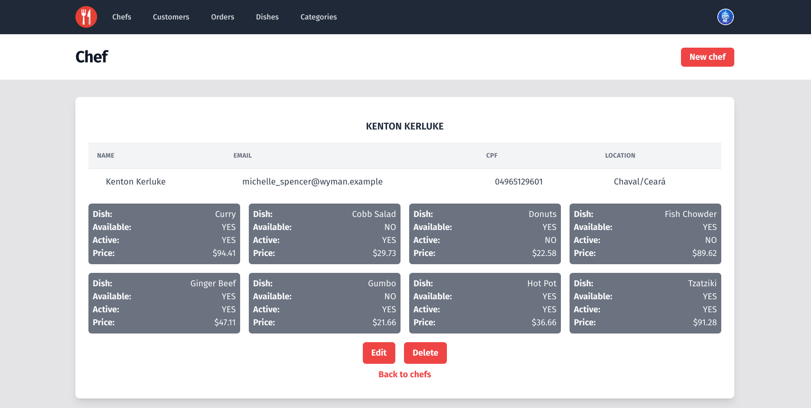
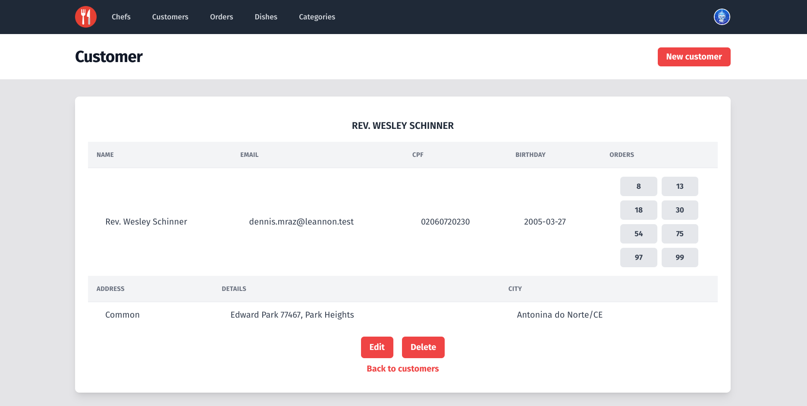
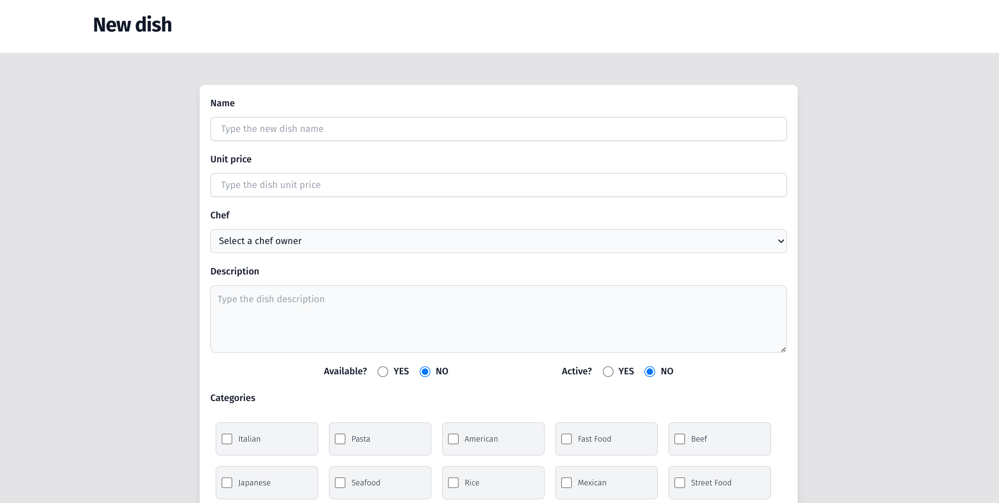
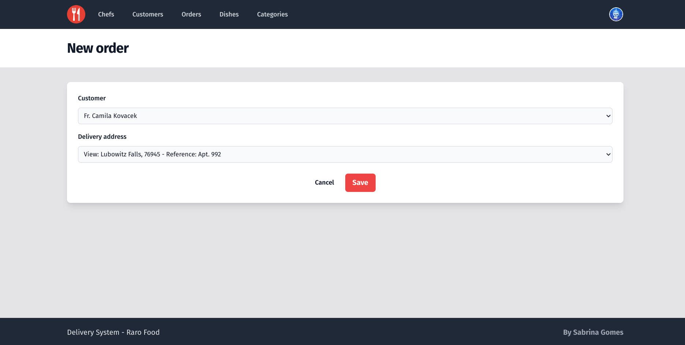
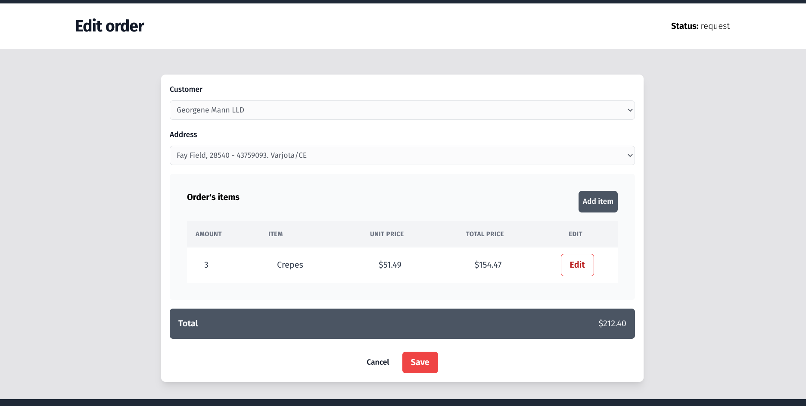
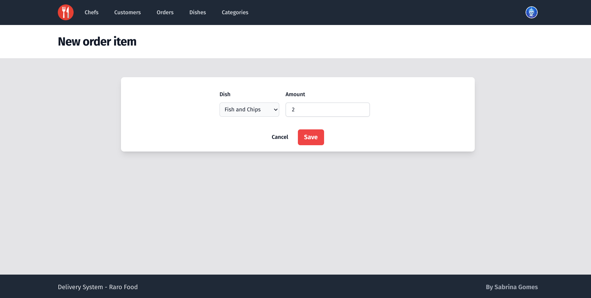
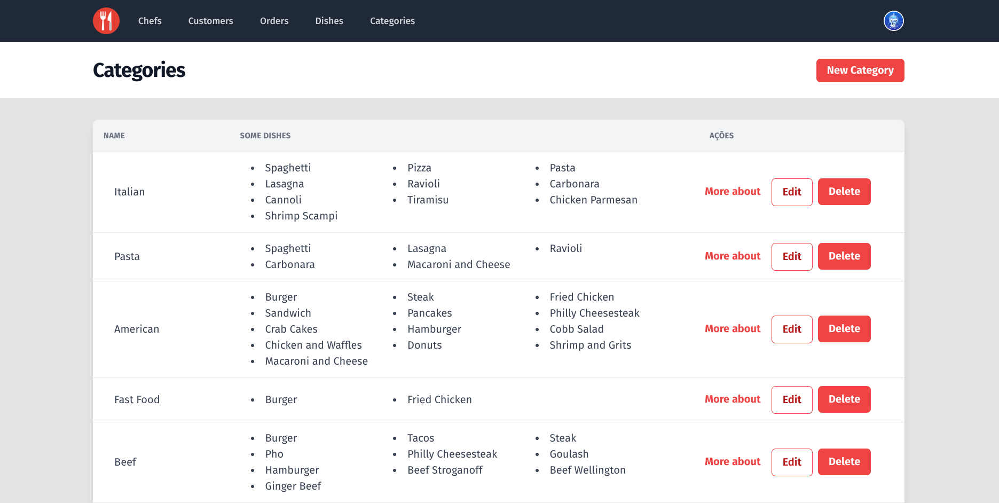
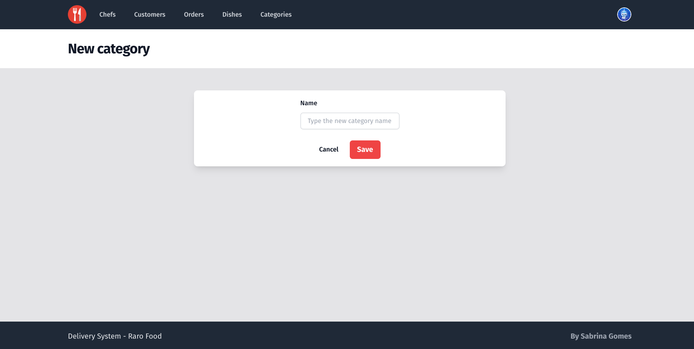
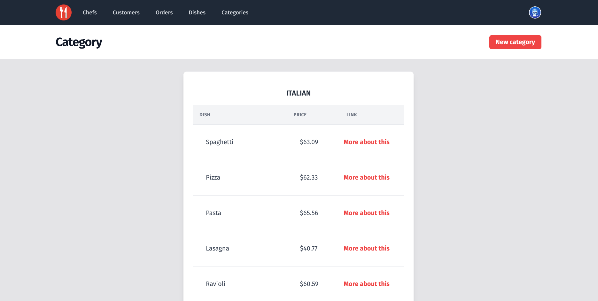

- [Views - Raro Food](#views---raro-food)
  - [Objetivos](#objetivos)
  - [Desenvolvimento](#desenvolvimento)
    - [Telas de listagem](#telas-de-listagem)
    - [Chef / Customer](#chef--customer)
    - [Dish](#dish)
    - [Order / Order Items](#order--order-items)
    - [Category](#category)
  - [Setup](#setup)
    - [Acesso](#acesso)

# Views - Raro Food

O projeto inicia a implementação de telas da aplicação Raro Food que tem sido desenvolvida desde a semana 7 da turma de Ruby on Rails - Raro Academy.

## Objetivos

Tendo como base o [enunciado do exercício](./.gitlab/enunciado.md), os objetos são:

- [x] Implementar as [telas sugeridas](https://drive.google.com/file/d/1SHRJgKFDVwzCxp2foO-V911MRXzazLtj/view) utilizando tags html de forma semântica, bem como componentes coerentes com os dados e seus respectivos atributos;
- [x] Usar corretamente métodos e helpers fornecidos pelo Rails para construção de formulários, telas e respostas às requisições;
- [x] Apresentar telas funcionais que manipulem e registre dados corretamente;
- [x] Utilizar Tailwind, SASS ou CSS puro para estilização e harmonia do design;
- [x] Implementar Gem Devise;
- [x] Restringir o acesso da telas para que estejam acessíveis através de email e senha.

## Desenvolvimento

Para iniciar a atividade foi realizado um clone do repositório da aplicação Raro Food disponível no GitLab da Raro Academy, dessa forma o desenvolvimento foi realizado a partir da modelagem estabelecida e sem implementação prévia de controllers. O desenvolvimento foi todo realizado utilizando o inglês, por isso as telas também estão nesse padrão. Dessa forma, caso for preciso, pode ser utilizada a gem I18n para traduzir o sistema para um outro idioma ou realizar o suporte para múltiplas línguas.

Abaixo estão listados outros pontos importantes referente ao desenvolvimento da atividade.

### Telas de listagem

- No projeto clonado de base já havia um `seeds.rb` com informações de States e Cities, esse arquivo foi incrementado para popular todas as outras tabelas do banco de dados utilizando a gem [Faker](https://github.com/faker-ruby/faker) na sua versão mais recente. Dessa forma, conseguimos visualizar várias informações nas telas de listagem.

### Chef / Customer

- Tanto para o cadastro de Chef como para o cadastro de Customer foi necessário utilizar o método `build` nos seus respectivos _controllers_, pois na modelagem do projeto utilizado essas duas entidades herdam atributos da entidade User. Ambas também tem relação com a entidade Address, sendo que o Chef tem uma relação obrigatória, ele só pode ser criado se tiver um endereço associado, enquanto Customer pode ter vários endereços. No escopo de formulário foram definidos _fields_ para User e Address/Addresses.
- Para ambos, além das telas de _Create_, também foram implementadas as telas funcionais de _Read_ e _Edit_. Na listagem há também a opção de _Delete_. Abaixo estão alguns exemplos.
  <br>
  <div align="center">
  
  
  </div>
  <div align="center">
  
  
  </div>
  <br>

### Dish

- Para Dishes também há a tela de edição e a tela de listagem com o botão para exclusão, na tela de cadastro há o _select_ para definir o Chef associado aquele dish e checkboxes para as categorias e para os status de available e active.

  <div align="center">
    
    
  </div>
    <br>

### Order / Order Items

- Na tela de cadastro de **Order** foi usado o _imput_ do tipo _select_, conforme a tela sugerida. Além disso, foi implementado também um segundo select que é preenchido automaticamente com as opções de endereços do Customer selecionado. Essa implementação foi realizada utilizando JavaScript, o arquivo `order.js` tem a função de realizar a requisição para trazer a informação do endereço e a função de ficar ouvindo quando o select do Customer é utilizado para disparar a requisição.
- Ao acessar a tela de edição são exibidos os itens daquela _order_ e um botão para adicionar um novo item. Esse botão quando acionado carrega uma nova tela de _create_ da entidade Order Item, nessa tela de cadastro de item há um select que mostra apenas os _dishes_ quem tem o valor true para os atributos available e active. Os resultados podem ser visualizados abaixo.

  <div align="center">
    
    
    
  </div>
    <br>

### Category

- E por fim, temos a implementação de listagem, criação, edição e deleção da entidade Category. Para que as categorias ficassem mais coerentes com os _dishes_, foi incluído no `seeds.rb` um objeto fazendo a associação correta entre Categorias e Dishes. Segue o resultado.

  <div align="center">
    
    
    
  </div>

## Setup

O projeto foi realizado utilizando as versões:

- ruby 3.1.2;
- rails 7.0.4.3.

Antes de iniciar a aplicação, é necessário exportar as variáveis de ambientes no terminal, de acordo com seu acesso pessoal ao MySQL:

```bash
  export MYQSL_USER=SEU_USUARIO
  export MYQSL_PASSWORD=SUA_SENHA
  export MYQSL_HOST=localhost
```

Recomenda-se também a execução da seguinte sequência de comandos:

```bash
  bundle install
  yarn install
  rails db:create
  rails db:migrate
  rails db:seed
```

Para iniciar o servidor recomenda-se a utilização do comando `./bin/dev`, pois ele garante que os assets serão todos devidamente processados.

### Acesso

- Usuário root: email: root@root.com, password: root@123
